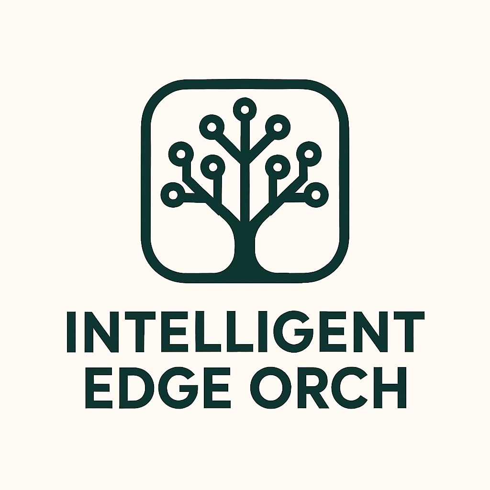

<p align="center">
  
</p>

# Margo Hello World

<p align="center">
  <em>Lightweight Edge Orchestration Platform (CO / LO / EN)</em>
</p>


**margo-hello-world** is a lightweight **edge orchestration platform** demonstrating CO (Coordinator), LO (Local Orchestrator), and EN (Edge Node) services for IoT, retail, and industrial edge computing environments.


## Key Features

- **Security-First Architecture** – Enterprise-grade protection for all edge deployments.
- **Deployment automation** ensures that software can be delivered to thousands of distributed edge nodes (far edge or device edge) with minimal manual intervention.  
- **Deploy AI Workloads at the Edge & IoT Devices** – Run applications closer to the data for faster insights.
- **Intelligent Edge Node Selection** – Automatically pick the best devices for deployment.
- **Offline-First Support** – Works smoothly even with intermittent or unreliable network connections.
- **App & Device Stores** –
    - App developers can register applications in the App Store.
    - Device developers can register edge devices in the Device Store.
- **Customer Access via CLI and Web Portal** – Manage and monitor deployments through command-line tools or a web interface.
- **Remote Workloads Lifecycle Management** – Add, update, and remove workloads on edge devices remotely. Air-gap environment supported
- **Interoperable Runtime Support** – Works with different runtime environments, including WASM/Ocre, container-based, and Kubernetes-based runtimes. Supports a range of devices from **small microcontrollers (MCP)** to **more powerful microprocessors (MPC)**.
- **Industry Focus** – Designed for industrial settings, manufacturing shop floors, and retail environments. 


### Architecture

Three-tier orchestration system:
- CO – Central Orchestrator  
- LO – Local Orchestrator (per site)  
- EN – Edge Node (per host)  
Users interact via Web Portal or CLI through CO API.

```
            +----------------------+
            | Web Portal / CLI     |
            +----------+-----------+
                       |
                       v
            +----------------------+
            | Central Orchestrator |
            |  (CO)                |
            +----------+-----------+
                       | Margo API
    -------------------------------------------------
    |                    |                         |
+----------------+   +----------------+     +----------------+
| Local Orchestr.|   | Local Orchestr.|     | Local Orchestr.|
|   (LO - Site A)|   |   (LO - Site B)| ... |   (LO - Site N)|
+--------+-------+   +--------+-------+     +--------+-------+
         |                  |                        |
   Overlay or Local Net  Overlay or Local Net  Overlay or Local Net
         |                  |                        |
   +-----------+       +-----------+           +-----------+
   | Host1     |       | Host4     |           | Host7     |
   | (EN1)     |       | (EN4)     |           | (EN7)     |
   | K8s/OCI/WASM|     | K8s/OCI/WASM|         | K8s/OCI/WASM|
   +-----------+       +-----------+           +-----------+
   | Host2     |       | Host5     |           | Host8     |
   | (EN2)     |       | (EN5)     |           | (EN8)     |
   | K8s/OCI/WASM|     | K8s/OCI/WASM|         | K8s/OCI/WASM|
   +-----------+       +-----------+           +-----------+
   | Host3     |       | Host6     |           | Host9     |
   | (EN3)     |       | (EN6)     |           | (EN9)     |
   | K8s/OCI/WASM|     | K8s/OCI/WASM|         | K8s/OCI/WASM|
   +-----------+       +-----------+           +-----------+
```        

- **ENs (Edge Nodes)** now explicitly show that each node can run workloads in multiple runtimes:
    - **K8s** – Kubernetes orchestrated containers.
    - **OCI / containerd** – Standard OCI containers.
    - **WASM** – Lightweight WebAssembly workloads.
- Each **LO** manages a **site** (e.g., factory floor, retail store) and connects to its **ENs** via overlay or local network.
- CO (Central Orchestrator) remains the control plane, accessible through **Web Portal / CLI**, using **Margo API**.

### Components

- **CO (Central Orchestrator):** API server that manages profile selection, app registry, deployment registry, and git push operations. Handles all communications with Local Orchestrators (LO) and Edge Nodes (EN). Implements the server side of the API and provides access to both the CLI and the Web Portal. Supports GitOps workflows. 
- **LO (Local Orchestrator):** Observes git repositories (pull-based) and pushes changes to Edge Nodes. Deploys workloads to multiple edges in parallel. Adaptive to intermittent network conditions - changes to Git pull, push or NATS based event driven communication with CO
- **EN (Edge Node):** Agent implementing the client side of the API. Responsible for fetching OCI artifacts, supporting Helm-based deployments on Kubernetes, container-based runtimes, and WASM-based workloads.
- **Deployment Status & Node Capabilities:** Tracks deployment states and capabilities of each edge device.
- **edgectl:** CLI tool to access the CO API.
- **Web Portal:** Provides a graphical interface for managing deployments, apps, and devices.

### Data modeling
[Margo](margo.org) specification defined these data models
- *[application description](https://specification.margo.org/specification/application-package/application-description/):* defines the app specification, artifacts location, application resources requirements. 
- *[application deployment](https://specification.margo.org/specification/margo-management-interface/desired-state/)*: used for deploying workloads
- *[deployment status](https://specification.margo.org/specification/margo-management-interface/deployment-status/):* used for communicating the workload deployment status
- *[device capabilities](https://specification.margo.org/specification/margo-management-interface/device-capabilities/)*: edge node capabilities like cpu, memory, gpu etc
- *sites, hosts, orchestrator, tenants*

### Roadmap
- runtime: wasm, k3s/k8, Talos linux based k8s
- rich intelligent profile selection at CO
- margo based security between CO and LO
- otel  based observability
- CLI, web portal: OAuth2 for portal/API using keycloak
- web portal

## Getting started

1. start the docker compose and verify the containers are properly created: 
```
podman-compose --env-file .env.staging up -d

docker ps
```

2. Open web portal
```
npm run dev
```
Open [http://localhost:3000](http://localhost:3000) with your browser to see the result.

3. open CLI
go to edgectl directory
```
go run main.go co status
```
4. Add the sample app to app store
```
$ go run main.go co add app --name "com-northstartida-digitron-orchestrator" --artifact https://github.com/edge-orchestration-platform/app-registry
Adding new application ...
✅ Application added successfully!

$ go run main.go co list apps
Listing apps ...
✅ Available applications:
 1. Digitron orchestrator 1.2.1      http://www.northstar-ida.com com-northstartida-digitron-orchestrator
```
5. deploy sample app
```
go run main.go co deploy --app "Digitron orchestrator" --site 3e5c21bc-2fef-4fd7-a2d0-60fc6b3260ad --deploytype compose 
```

### 💬 Contributing

See [CONTRIBUTING.md](contributing.md)
 for guidelines.
We welcome contributions in all forms:
- Bug reports
- Feature requests
- Code fixes
- Tests & CI/CD improvements
- Documentation improvements

### Folders structure
cmd
- cmd
	- co
	- lo
	- en
- ent                                <-- persistable data models
	- schema                    <-- this is where you create data model
	- migrate/migrations <-- atlas based migrations
- internal
	- orchestrator
	- gitobserver
	- gitwriter
	- gitfetcher
	- ocifetch
	- api
	- edgenodes 
- pkg
	- model
- atlas.hcl                          <--- db migration configuration
- docker-compose.yaml   <--- spins nats, postgres, co, lo, en containers
- dockerfile.co                  <--- co container
- dockerfile.lo                   <--- lo container
- dockerfile.en                  <--- en container 
- go.mod                           

### Tech stack
co, lo, en:
- messaging: NATS
- db: ent, atlas, postgres, boltz db
- go-git (neutralized git access)
- golang
- metrics: prometheus
- logger: zap 

web portal: 
- next.js, shadcn, tailwind.css 

cli: 
- cobra


## Code 
```
go run ./cmd/co --config=./configs/co.yml
go run ./cmd/lo 
go run ./cmd/en
```

#### Configuration
```
GITHUB_TOKEN=
DATABASE_URL=
SITE_ID  = 
NODE_ID  =
RUNTIME = containerd(default), wasm, compose_pkg, helm
DEPLOYMENTS_REPO = https://github.com/edge-orchestration-platform/deployments (this is where co writes deployment requests. lo will monitor for this repo changes for its site)
APPLICATIONS_REPO = https://github.com/edge-orchestration-platform/app-registry (this is for testing. actual repo will be on developers site)
AI_SAMPLE_DEMO = ghcr.io/edge-orchestration-platform/edge-ai-sample(sample edge ai)
```
##### Data Models addition/modifications

go to root directory
add schema files to `ent/schema` and then 

```
ent generate ./ent/schema  --feature sql/upsert
atlas migrate diff add_deloymentstatus --env local --to "ent://ent/schema"
atlas migrate apply --env local
```
uses atlas.hcl at the root directory

## 📄 License
This project is licensed under the MIT License – see [LICENSE](license.md)
 for details.
